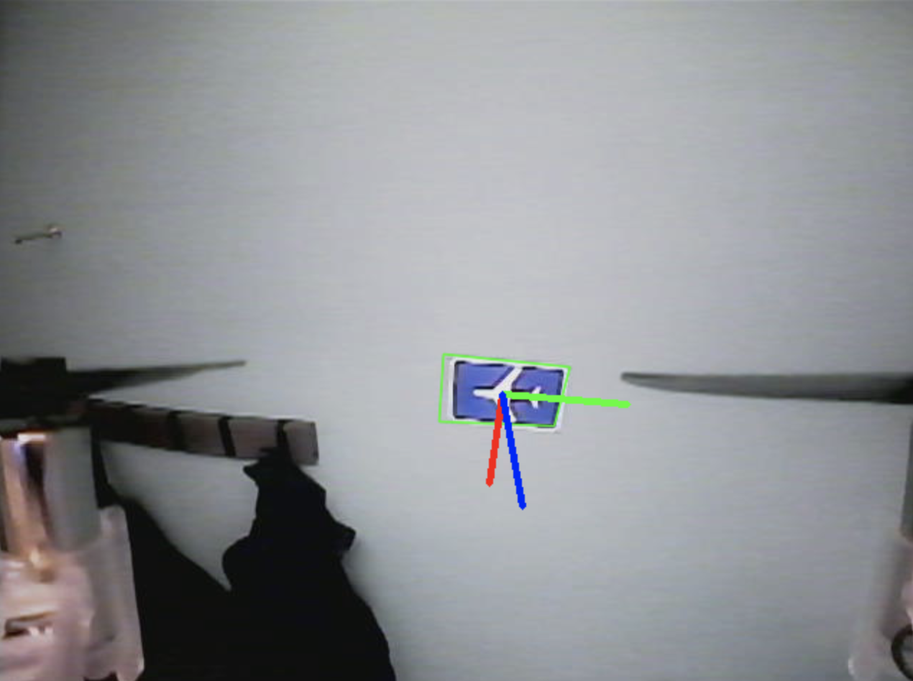

# Drone Project
Execute these commands to run the whole integrated system

to find camera: 
cvlc v4l2:///dev/v4l/by-id/usb-ARKMICRO_USB2.0_PC_CAMERA-video-index0 :live-caching=25

## Brain
```
roslaunch dd2419_launch base.launch ch:=96
rviz
rqt &
roslaunch dd2419_launch world_publisher.launch world_name:=saal2
rosrun part2 navgoal3
```

## Localization
```
rosrun localization static
rosrun localization loc3_sameID
```

## Perception
dependecies: PyTorch (python3)

```
rosrun perception perception.py
rosrun perception trainsforms.py
rosrun perception intruder.py
```
perception runs sign detection and publishes detected markers as markerarrays
trainsforms publishes detected signs as transforms /perception/detectedX
and signs from the map as /perception/signX



## Pathplanning
animation of path
```
rosrun Pathplanning a_star.py
```
